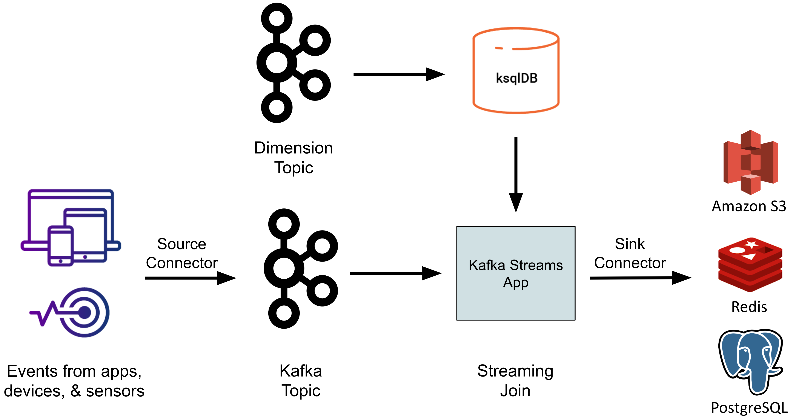
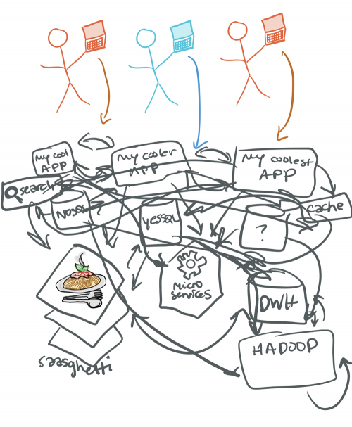
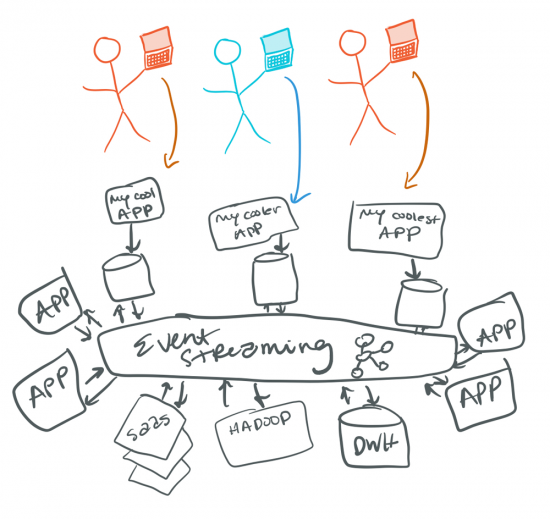
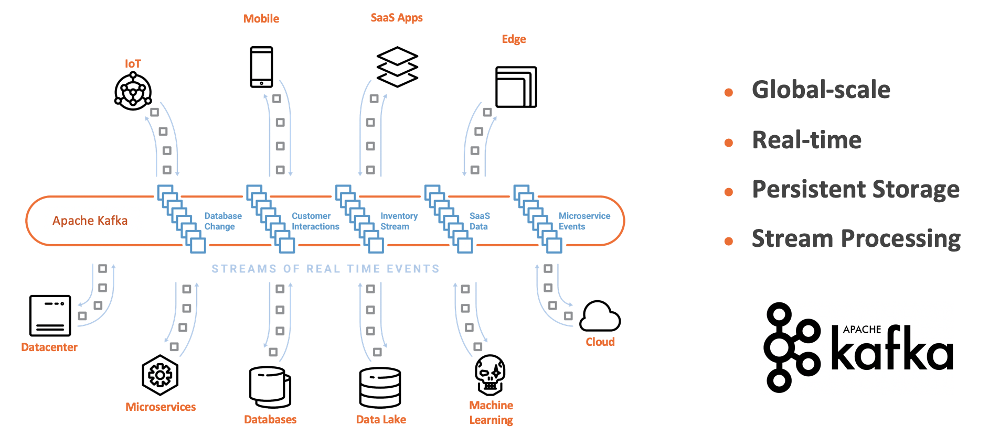
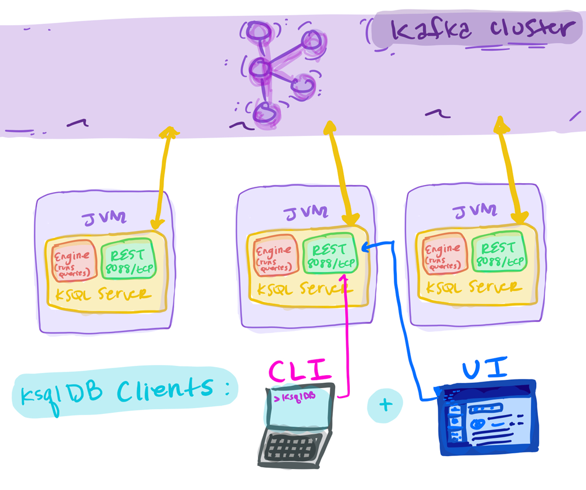
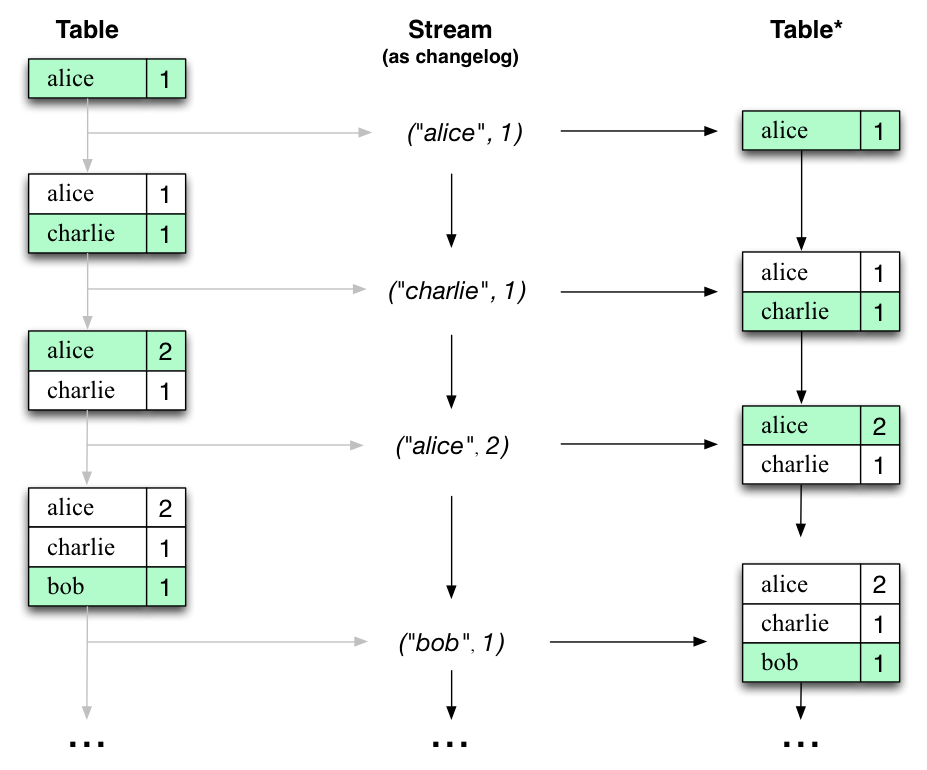
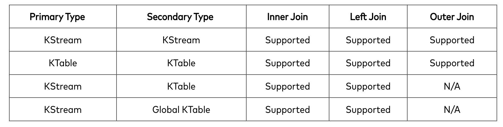
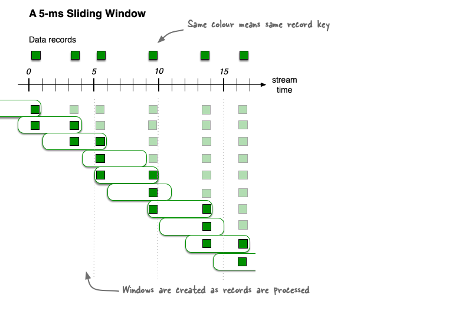

# Введение в Kafka Streams

## Применение Kafka Streams для обработки потоковых данных: Основные концепции, примеры и сравнение с ksqlDB

### Какую скрытыю проблему мы хотим решить чаще всего?



### С помощью чего мы можем это решить? 



### Что такое Apache Kafka?

Начинающие пользователи Kafka, как правило, имеют несколько убедительных причин для использования
Kafka в своей инфраструктуре. Первоначальным вариантом использования может быть применение
Kafka для интеграции баз данных. Это особенно полезно при наличии тесно связанных,
но разрозненных баз данных - часто RDBMS и NoSQL, - которые могут стать единой точкой отказа
в критически важных приложениях и привести к неудачной архитектуре "спагетти".

Прежде всего, Kafka - это НЕ просто система обмена сообщениями pub/sub для передачи данных из 
пункта А в пункт Б. Именно так обычно отвечают на подобный вопрос почти все люди, считающие, 
что Kafka - это очередной IBM MQ или RabbitMQ. Нет.



### Основные концепции Apache Kafka?

Одной из основных причин, по которой Apache Kafka стал стандартом де-факто для столь большого числа 
различных вариантов использования, является сочетание четырех мощных концепций:

- **Publish and subscribe** на потоки событий, подобно очереди сообщений или корпоративной системе обмена 
сообщениями.
- **Store** потоки событий в отказоустойчивом хранилище сколь угодно долго (часы, дни, месяцы, вечность).
- **Process** потоки событий в реальном времени, по мере их возникновения.
- **Integration** различных источников и стоков (неважно, в реальном времени, пакетно или запрос-ответ)

Именно поэтому вокруг кафки выстраивается такая мощная экасистема.

### Сравнение Kafka Streams и ksqlDB - Как выбрать

Ответ сводится к:
- сочетанию ресурсов
- способностей команды 
- специфики использования

### KsqlDB



KsqlDB предоставляет нам API.

Варианты использования:
- CLI
- client API:

### Минусы KsqlDB:

- Более сложный барьер для входа
- Не покрывает весь **Kafka Streams API**
- Отдельный жизненый цикл(отдельный сервер)
- Поддержка(обслуживание ложиться на плечи **DevOps**)
- Собственные логи
- Миграция скриптов(создание, хранение, деплой)
- Нет способов управлять consumer-groups(_Покрайней мере не нашел как это сделать_)
- Нет возможности написать свою кастомную логику
- псевдо язык
- тесты

### Kafka Streams

Kafka Streams имеет низкий барьер для входа: Вы можете быстро написать и запустить небольшую пробную
версию на одной машине, а для масштабирования до больших производственных нагрузок достаточно
запустить дополнительные экземпляры приложения на нескольких машинах. Kafka Streams прозрачно
справляется с распределением нагрузки между несколькими экземплярами одного и того же приложения,
используя модель параллелизма Kafka.

Вся работа с кафкой строиться на базе **Producers** and **Consumers**. Но все зависит 
от того, в каком виде мы представляем эти Producers and Consumers:

- Producer and Consumer
- Spring (boot, cloud)
- Connectors
- Kafka Stream

#### Processing Data: Vanilla Kafka vs. Kafka Streams

Kafka Streams является абстракцией над продюсерами и консьюмерами, позволяющей 
игнорировать низкоуровневые детали и сосредоточиться на обработке данных в Kafka.
Поскольку Kafka Streams работает на основе декларативного подхода, код обработки, 
написанный с использованием Kafka Streams, намного более лаконичен, чем код, 
написанный с использованием низкоуровневых клиентов Kafka.

```java
 try(Consumer<String, Widget> consumer = new KafkaConsumer<>(consumerProperties());
    Producer<String, Widget> producer = new KafkaProducer<>(producerProperties())) {
        consumer.subscribe(Collections.singletonList("widgets"));
        while (true) {
            ConsumerRecords<String, Widget> records =    consumer.poll(Duration.ofSeconds(5));
                for (ConsumerRecord<String, Widget> record : records) {
                    Widget widget = record.value();
                    if (widget.getColour().equals("red") {
                        ProducerRecord<String, Widget> producerRecord = new ProducerRecord<>("widgets-red", record.key(), widget);
                        producer.send(producerRecord, (metadata, exception)-> {…….} );
               …
```

```java
final StreamsBuilder builder = new StreamsBuilder();
builder.stream("widgets", Consumed.with(stringSerde, widgetsSerde))
    .filter((key, widget) -> widget.getColour.equals("red"))
    .to("widgets-red", Produced.with(stringSerde, widgetsSerde));
```

#### Stream Processing Topology


#### Processor API vs DSL

#### DSL

Операции которые предоставляет нам библиотека: 

- stateless transformations (map, filter)
- stateful transformations (count, reduce)
- joins (leftJoin)
- windowing (session windowing, hopping windowing)

Абстракции для работы:

- KStream
- KTable
- KGlobalTable

### KTable



KTable - это концепция, которая позволяет нам преобразовывать непрерывные потоки данных в упорядоченные 
таблицы с ключами и значениями. Это мощный инструмент для агрегации, фильтрации, присоединения и 
анализа данных в реальном времени.

_**С помощью KTable мы можем:**_

- **Агрегировать данные по ключу:** Мы можем создавать таблицы, в которых ключом является какой-либо атрибут, 
а значением - результат агрегации данных для этого ключа. Это позволяет нам легко вычислять суммы, 
средние значения и другие агрегаты.
- **Присоединять данные из разных источников:** Мы можем объединять потоки данных, добавляя информацию 
из других таблиц и потоков. Это особенно полезно, когда нам нужно обогатить данные информацией из внешних источников.
- **Фильтровать и преобразовывать данные:** KTable позволяет нам легко фильтровать и преобразовывать данные,
исключая ненужные или изменяя формат, чтобы соответствовать нашим потребностям.
- **Вычислять агрегаты по времени:** Мы можем создавать временные окна и вычислять агрегаты внутри них, 
что позволяет анализировать динамику данных во времени.

### Join

_**С помощью Join мы можем:**_

- Обогощать данные
- Фильтровать данные



### Windowing

**- Tumbling time window**

Это временные окна без перекрытия, которые не накладываются друг на друга. 
Каждое окно начинается и завершается строго в соответствии с указанными интервалами.
Это подходит, когда нам нужен дискретный анализ данных во времени.


**- Hopping time window**

Это временные окна, которые "прыгают" через поток данных с перекрытием. 
Мы указываем длительность окна и интервал его смещения.
Такие окна полезны, когда нам нужно проводить анализ с перекрытием данных.


**- Session window**

Эти окна группируют данные в сессии, основанные на временных интервалах между событиями.
Сессионные окна полезны для анализа взаимодействий между событиями в потоке.


**- Sliding time window**

Sliding Window  представляет собой окно, которое "скользит" по потоку данных с перекрытием.
В этом окне мы задаем длительность окна и интервал смещения (как часто окно "скользит"). 
Это позволяет проводить анализ данных внутри окон, которые могут перекрываться с предыдущими окнами.

Преимущества Sliding Window включают возможность более частого и непрерывного анализа данных 
по сравнению с Tumbling Window, который имеет дискретные окна без перекрытия.

Sliding Window особенно полезно, когда нам нужно следить за изменениями данных и трендами 
в реальном времени с более гибкими временными интервалами.



## Presentation

<a href="https://github.com/zh-efimenko/demo-kafka-streams/blob/main/docs/kafka Stream.pptx" title="Presentation" download>Presentation</a>
